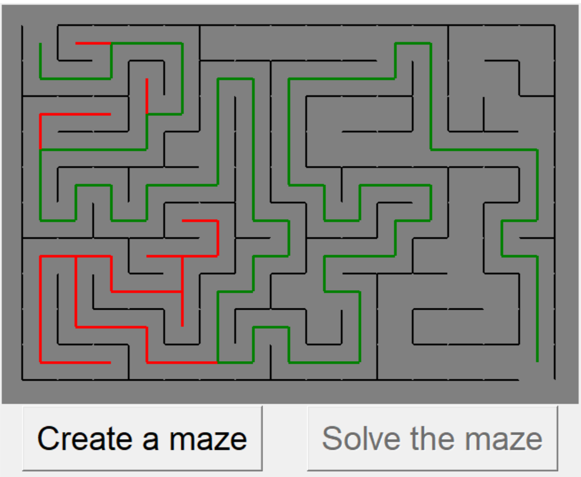

# Maze-Solver
A Python Tkinter maze solver. Created for a [boot.dev](https://www.boot.dev/courses/build-maze-solver-python) course.

## Description
Creates and solves a random maze with given parameters, which can be changed in constants.py.

